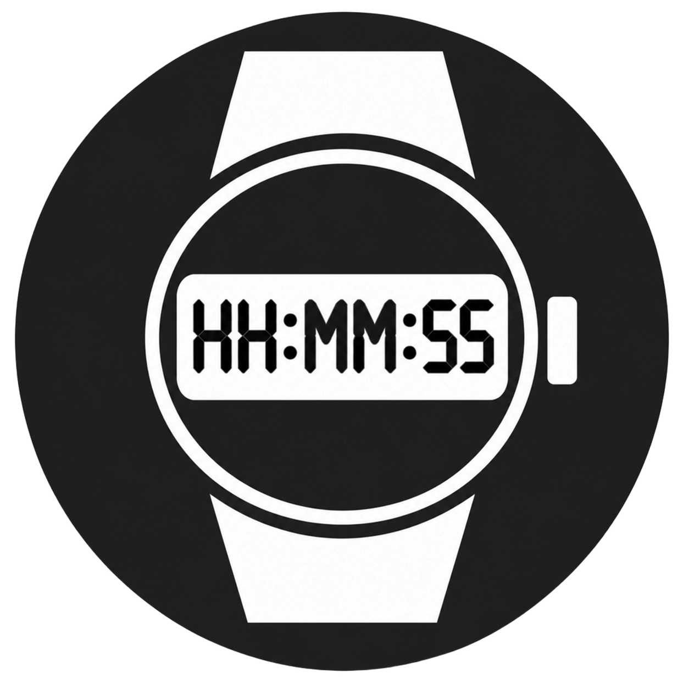

<h1 align="center">Full Digital Clock</h1>
<p align="center">
  
</p>

# Wear OS Digital Clock with Seconds

A high-performance, battery-optimized digital clock application designed specifically for Wear OS devices. Built entirely using **Kotlin** and **Jetpack Compose for Wear OS**, this standalone watch application provides a precise time display with seconds, featuring advanced lifecycle management and dynamic screen timeout configuration.

## 🚀 Key Features

* **OLED-Optimized Dark Mode**: Features a pure black `#000000` background that turns off physical pixels on OLED screens to drastically reduce power consumption.
* **Dynamic Screen-On Toggle**: Simple tap gestures allow the user to toggle between standard system timeout (White text) and persistent Ambient Screen-On mode (Dim Red text).
* **Zero-Lag Startup**: Uses primitive native variables instead of traditional Compose States for critical Window Flags, completely removing activity initialization delays.
* **Strict Battery Optimization**: Automatically halts UI recomposition and background coroutine timers the millisecond the application goes off-screen (`onPause`).
* **Auto-Scale Typography**: Dynamically calculates the available horizontal viewport (`BoxWithConstraints`) to scale the font to the absolute maximum size without clipping or text wrapping.
* **Aggressive Memory Management**: Clears residual process footprints and frees allocated RAM instantly upon exit (`android.os.Process.killProcess`).

## 🛠️ Architecture & Architecture Highlights

The codebase is optimized for low-resource wearable chips, adhering to strict Wear OS lifecycle standards:

* **Precise Sizing**: Uses standard monospace layout assumptions to fit `HH:mm:ss` inside any circular or rectangular Wear OS watch face dynamically.
* **Lifecycle Awareness**: Coroutine scopes live strictly under the visible lifecycle of the UI (`LaunchedEffect(isAppVisible)`), safeguarding against battery drain when the screen is dimmed or covered.
* **Swipe-to-Dismiss Protection**: Overrides `onStart` and `onPause` lifecycle hooks to clear window flags and prevent system-wide lockups when the user swipes to exit.

## 📋 Requirements

* **Minimum SDK**: Android API 26 (Wear OS 2.0 and above)
* **Target SDK**: Android API 33+ (Wear OS 4.0+)
* **Language**: Kotlin 1.9+
* **UI Toolkit**: Jetpack Compose for Wear OS

## 📦 Installation & Setup

1. **Clone the repository**:
   ```bash
   git clone https://github.com
   ```
2. **Open in Android Studio**:
   Import the project into Android Studio Flamingo (or newer).
3. **Build & Run**:
   Connect your Wear OS device via Wi-Fi ADB or launch a Wear OS emulator, then click **Run 'app'**.

## 👤 Personal Project Policy

This app is a **Personal Project**.

This means that this is something I created in my free time because I needed it myself, and I
decided to share it with the world.

If you like the app I'm happy to hear that! And if you have suggestions or if you find any bugs
please do let me know!

However, please be aware that you're not entitled to:

- Receiving support
- Having any bugs fixed
- Having any features added

If you would like to make the changes yourself, you're very welcome to send me a pull request.

## 🤝 Contributing

Contributions, issues, and feature requests are welcome! Feel free to check the issues page if you want to contribute.

## 📄 License

This project is licensed under the GNU General Public License v3.0 - see the LICENSE file for details.
